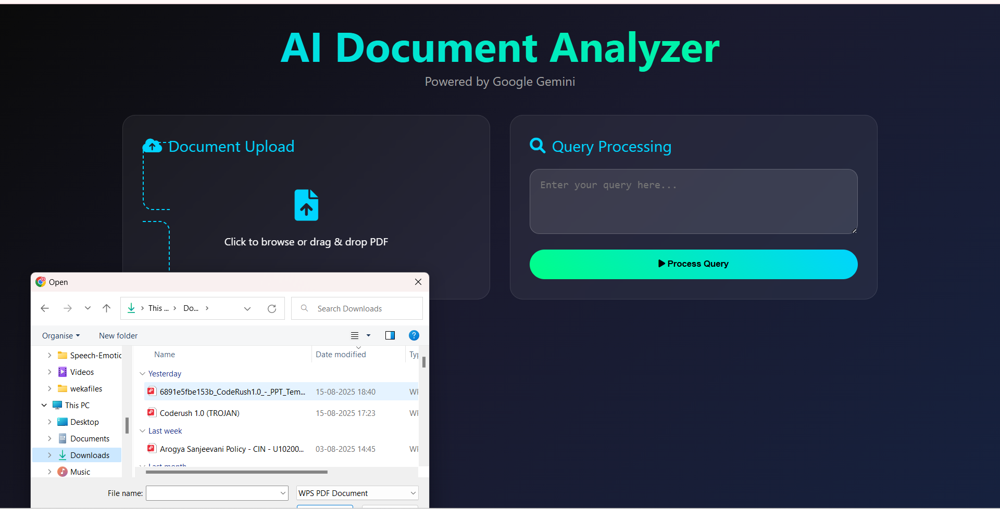

# AI Document Analyzer System

## 🌟 Overview
AI Document Analyzer System is a powerful web application leveraging advanced Large Language Models (Google Gemini) to analyze, query, and extract insights from complex documents—such as insurance policies, legal contracts, and more. Effortlessly upload PDF, Word, or text files, ask natural language questions, and receive precise, structured AI-powered answers with clear justifications.

---

## 📦 Features
- **AI-powered Q&A:** Interactive natural language querying via Google Gemini.
- **Supports PDF, DOCX, TXT:** Seamless upload and analysis.
- **OCR & Table Extraction:** Extracts text/tables from scanned or image-based documents.
- **Advanced Semantic Search:** Matches questions to relevant content.
- **Structured Results:** Decision, justification, and clause references in clean format.
- **Modern, Responsive UI:** Drag-and-drop upload, query history, mobile-friendly design.
- **Session Query History:** Sidebar showing previous queries and answers.
- **Error Handling:** Clear feedback banners for user guidance.
- **Easy Collaboration:** Shareable repo with team-friendly workflow.

---

## 🖥️ Visual Demonstrations

### Document Upload Flow


### Query & Result Card Example


---

## 🌳 Project Structure

project-root/
│
├── backend.py # FastAPI backend
├── app.html # Main frontend interface
├── home.html # Additional info/landing page
├── requirements.txt # Python dependencies
├── .env.example # Sample environment variables
├── static/ # Static assets folder
│ └── app.html
├── screenshots/ # Demo images
│ └── upload.png
│ └── result.png
│ └── dependency-graph.png
├── appdata.db # SQLite database (created automatically)
└── README.md # This documentation

text

---

## 📈 Dependency Tree

graph TD;
backend.py --> FastAPI
backend.py --> SQLAlchemy
backend.py --> PyPDF2
backend.py --> pdf2image
backend.py --> pytesseract
backend.py --> camelot-py
backend.py --> google-generativeai
backend.py --> chardet
backend.py --> dotenv
FastAPI --> Uvicorn

text

---

## 🚀 Quick Start

1. **Clone the repository**
git clone https://github.com/108harsh/ai-document-analyzer.git
cd ai-document-decision-system

text

2. **Install Python dependencies**
pip install -r requirements.txt

text

3. **Set up environment variables**
- Copy `.env.example` to `.env`:
  ```
  cp .env.example .env
  ```
- Add your Google Gemini API key to `.env`.

4. **Install external tools**
- **Tesseract OCR**: [Install guide](https://github.com/tesseract-ocr/tesseract)
- **Poppler** (for pdf2image): [Install guide](https://poppler.freedesktop.org/)
- **Ghostscript** (for Camelot): [Install guide](https://www.ghostscript.com/)

5. **Run the Application**
uvicorn backend:app --reload

text
- Visit [http://localhost:8000](http://localhost:8000) to use the frontend.

---

## ⚡ Usage

- **Upload your document** using drag-and-drop or file picker.
- **Enter your query** in plain English (e.g., "What is the claim waiting period?")
- **Receive structured results** with decision, justification, and referenced clauses.
- **Review your session history** in the sidebar.

---

## 🧩 Configuration

- All sensitive keys are stored in `.env` (never commit your real `.env`).
- Use `.env.example` as a template for new setups.
- Add `.env` to `.gitignore` to protect secrets.

---

## 💡 Troubleshooting

- If OCR or table extraction fails, ensure Tesseract, Poppler, and Ghostscript are installed and on your PATH.
- Invalid document format or large files may throw user-friendly error banners.

---

## 👥 Collaboration

- Public repo for open sharing; private repo for team confidentiality.
- Add teammates as collaborators via GitHub Settings.
- Share the repo link for easy access and setup.

---

## 🙏 Acknowledgements

- [FastAPI](https://fastapi.tiangolo.com/)
- [Google Gemini LLM](https://ai.google.dev/)
- [PyPDF2](https://github.com/py-pdf/PyPDF2)
- [Camelot](https://camelot-py.readthedocs.io/)
- [Tesseract OCR](https://github.com/tesseract-ocr/tesseract)
- [Poppler](https://poppler.freedesktop.org/)
- [Uvicorn](https://www.uvicorn.org/)

---

## 📞 Support

For issues, open a GitHub issue or contact the maintainer.

---
## Contact

email-guptaharsh1969@gmail.com

---
